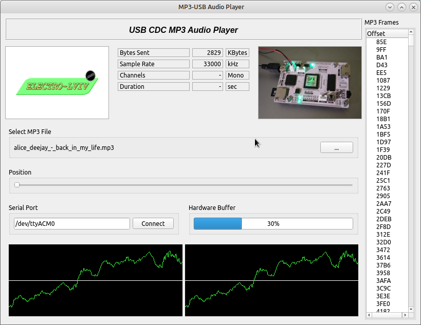
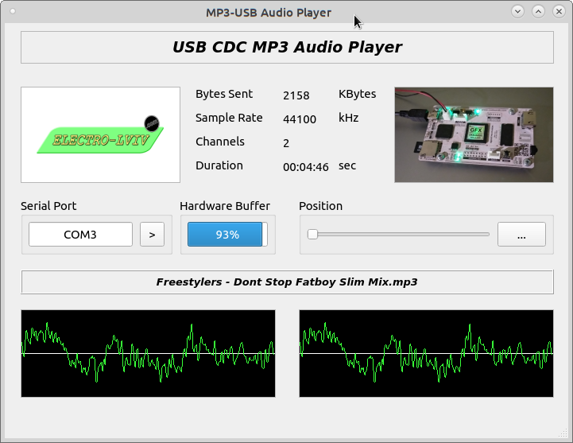

#### MP3 Player GUI for embedded devices

---
##### CDC AUDIO USB Project

Install dependencies: 

- PyQt5
- GStreamer
- pyserial    ( $ python3 -m pip install pyserial )
- audioread   ( $ python3 -m pip install audioread )

---
##### Setup user access to serial port:

<b>/dev/ttyACMx</b> for Linux 
 
<b>COM[n]</b> ST VCP USB Driver for Windows

    `$ sudo adduser yourUserName dialout`
    `$ sudo chmod a+rw /dev/ttyACM0`

##### Run application:

    ~$ python3 ./usbcdcaudio.py

Version: 0.0.2 beta

  

Version: 0.0.1 beta

  

